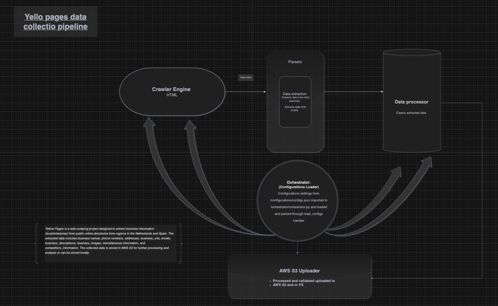

# Yellow Pages (Supported Content: Netherlands & Spain)



## Overview

Yellow Pages is a web scraping project designed to extract business information (local/enterprise) from public online directories from regions in the Netherlands and Spain. The extracted data includes business names, phone numbers, addresses, business_urls, emails, business_descriptions, business_images, miscellaneous information, and competitors_information. The collected data is stored in AWS S3 for further processing and analysis or can be stored locally.

## Features

- Search for any local business or profession in any region 
- Extracts total search results  and calculates pagination for available search entries.
- Crawls and extracts, cleans, models and indexes search results.
- Handles missing values with defaults.
- Stores the collected data locally or in AWS S3.
- Provides a clear easy configuration layer, so you don't have to dig into code.

## Prerequisites

- Python 3.x
- BeautifulSoup4
- Requests
- Boto3 

## Setup

1. Clone the repository:

    ```sh
    git clone https://github.com/raybags-dev/yellow-pages.git
    cd yellow-pages
    ```

2. Install the required dependencies:

    ```sh
    pip install -r requirements.txt
    ```

3. Set up AWS S3 credentials:

   Ensure you have your AWS credentials set up. You can do this by configuring the AWS CLI or setting the environment variables `AWS_ACCESS_KEY_ID` and `AWS_SECRET_ACCESS_KEY`.

## Usage
   - The application consists of 3 modules 
     - Orchestrator: Handles initial search, and pagination
     - Downloader: Handles profile downloader for each individual profiles
     - Parser: Handles collected data procession to ready-save state
   - All these modules can be run individually by enabling/disabling the `can_run` parameter OR all modules can be run asynchronously in a pipeline in which each application listens for a ready-signal from the other
   - Logging is robust but can be improved by piping it to an external service like `AWS CloudWatch` 
   - You can update configurations in the file below to control the above functional flow. 

```sh
   configurations/configs.json
```